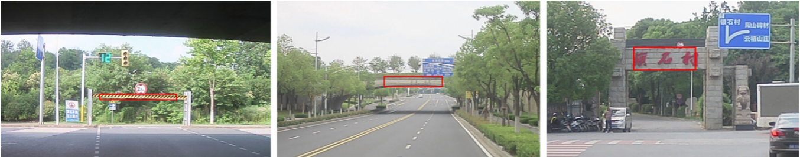
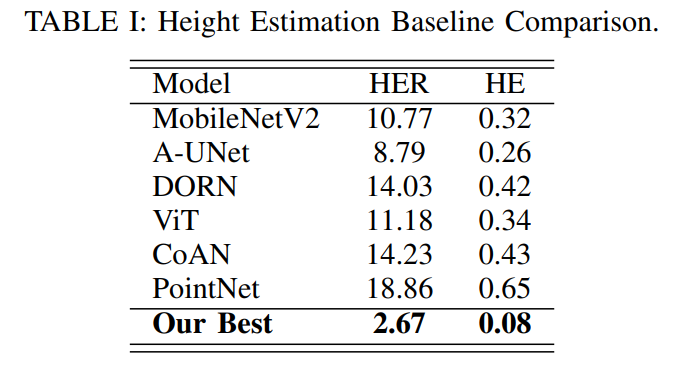
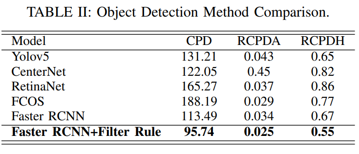
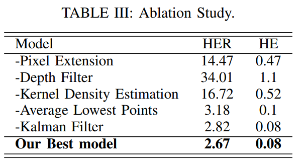
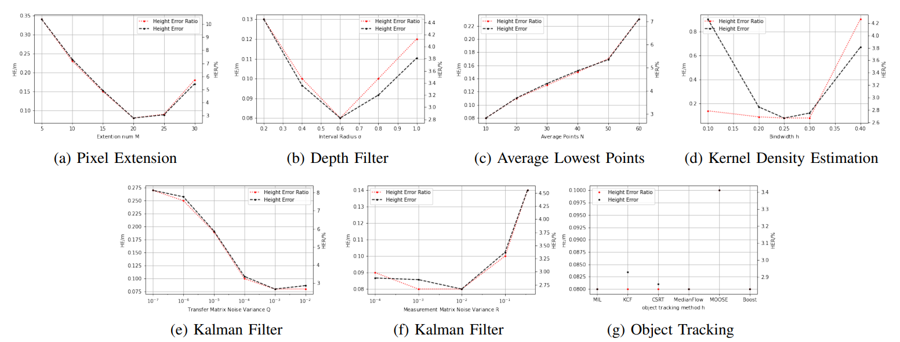

# SHLE-Devices-Tracking-and-Depth-Filtering-for-Stereo-based-Height-Limit-Esimation

Official code of "SHLE: Devices Tracking and Depth Filtering for Stereo-based Height Limit Esimation".

 `<br>`

Recently, over-height vehicle strike frequently occurs, causing great economic cost and serious safety problems. Hence, an alert system which can accurately discover any possible height limiting devices in advance is necessary to be employed in modern large or medium sized cars, such as touring cars. Detecting height limiting devices and estimating the height limit bars act as the key point of a successful height limit alert system. Though there are some works research height limit estimation, existing methods are either too computational expensive or not accurate enough. `<br>`
In this paper, we propose a novel stereo-based pipeline named SHLE for height limit estimation. Our SHLE pipeline consists of two stages. In stage 1, a novel devices detection and tracking scheme is introduced, which accurately locate the height limit devices in the left or right image. Then, in stage 2, the depth is temporally measured, extracted and filtered to calculate the height limit bar. To benchmark the height limit estimation task, we build a large-scale dataset named “Disparity Height”, where stereo images, pre-computed disparities and ground-truth height limit annotations are provided. We conducted extensive experiments on “Disparity Height” and the results show that SHLE achieves an average error below than 5cm though the car is 70m away from the devices. Our method also outperforms all compared baselines and achieves state-of-the-art performance. Code will be publicly available for further research.

## Dataset
### Brief Discription
 `<br>`
Since we are the first to utilize vision based methods for height limit estimation task. Therefore, there is no public available dataset that we can use. To benchmark our task, we propose a novel large-scale dataset named "Disparity Height". For shooting setting, the baseline of our stereo camera is 120 mm, the camera mounting height is 1.45 m, the resolution of taken photos is $1280 \times 720$. "Disparity Height" is collected in natural outdoor driving conditions and has a total of 1587 images from 13 scenes, which covers large different types of height limit devices. Simultaneously, corresponding height of the limiters, camera parameters and stereo disparity map are also recorded. Then each image is labelled with bounding box of corresponding height limiter by $Labelme$.`<br>`
In this dataset, we not only consider different scenes, but also consider the effects of different lighting, weather, etc. Moreover, to verify the generalizability of SHLE designed in this paper, we use the data in the first 10 scene as the training set, and the data in the last 3 scene as the test set. Therefore, "Disparity Height" is a very challenging dataset. It is very meaningful to evaluate the performance of our method and the baselines.`<br>`

### Download URL
In this project, we only provide partial data of "Disparity Heigh for the execution of "demo.sh", and the trained height limiter detector(object detection model) is also provided in this URL.<br>
   URL: https://pan.baidu.com/s/1TCP-UFrUwsYHhJ0oHYCNlg 
   pwd: pupb 

## USER GUIDANCE
### Installation

```bash
   $git clone git@github.com:Yang-Kaixing/SHLE.git
   $cd SHLE
   $pip install -r requirements.txt
```
### Demo

The demo videos can be generated by running:`<br>`

   ```bash
      sh demo.sh
   ```
You should reset the variable **HOME_DIR** in ``demo.sh``, i.e., ``export HOME_DIR='Your SHLE Project Path'``
After download the demo data and trained model, we should move them to correct directory, i.e., move demo data to ``$HOME_DIR/data/labelme_data/`` and move trained model to ``$HOME_DIR/data/original_data/``.<br>
The output video of ```demo.sh``` is stored in ``$HOME_DIR/output/video.mp4`` 


<!-- <iframe height=720 width=1280 src="本地视频路径"> -->

The effect of SHLE is shown in this video.

## Experiment Results
### Baseline Comparision

 `<br>`
Since nobody currently uses deep learning methods in height estimation tasks, we can only transfer models that have achieved excellent results in other similar tasks as baseline for experimental effect pairs, as TABLE I.

### Object Detection

 `<br>`
In our framework, the performance of object detection directly affect follow-up post-process, method of object detection can be treated as the backbone. TABLE II show the performance of all the candidate object detection methods in our dataset.

### Ablation Study

 `<br>`
To further research the impact of each part in SHLE, we conduct a series of ablation study, the results are shown in TABLE III.

## Hyperparameter

 `<br>`
Above image shows the specific hyper-parameter process, taking Height Error Rate(HER: red) and Height Error(HE: black) as vertical axis.
